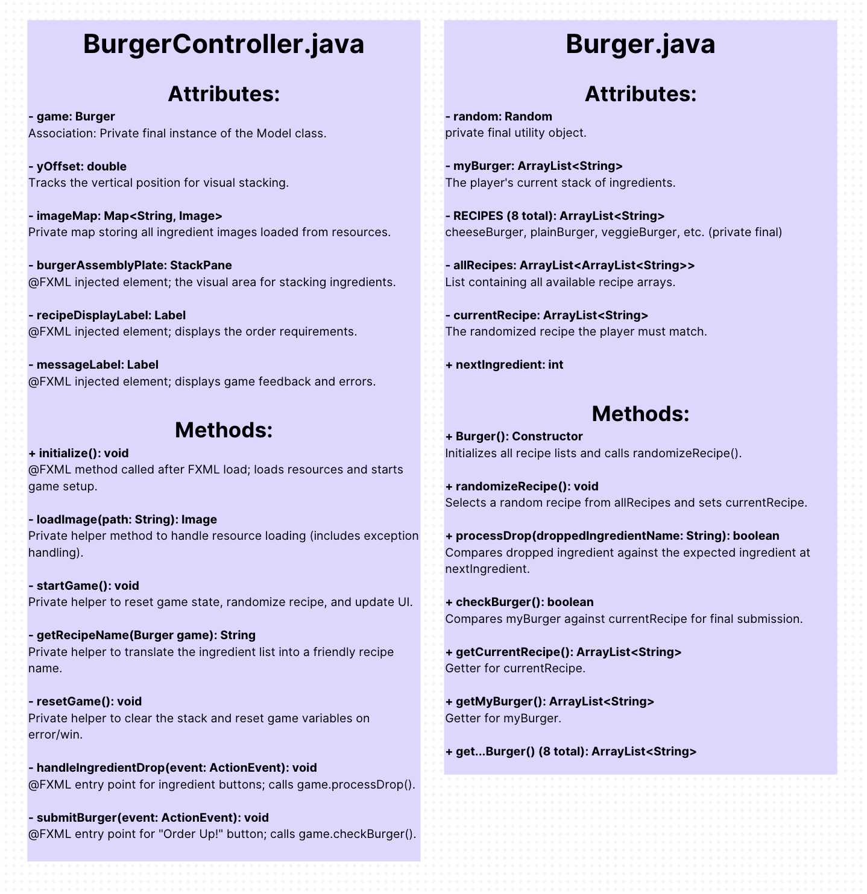

# **Stackers**

Stackers is a simple JavaFX application designed for the user to stack burgers in a specific order. There are randomized recipes based on customer recipes, all with a set specific order

# **Technologies Used**

- JavaFX: For the graphical user interface (GUI).

- FXML: Declarative language used to define the user interface layout.

- Java: Core application logic (Controller and Model classes).

# **Key Features**

- Randomized Orders: The game generates a random recipe (e.g., "Cheese Burger", "Double Cheeseburger") for the player to follow.

- Order Validation: Real-time checking ensures that only the correct ingredient can be placed next in the sequence.

- Visual Stacking: Ingredients are dynamically added to the central StackPane using visual compression for a grounded, realistic look.

- Feedback System: Provides instant feedback on correct drops, wrong moves, and final order status.

- Clear Project Structure: Utilizes a clean Model-View-Controller (MVC) separation:

- Burger.java (Model): Handles all game logic and recipe definitions.

- BurgerController.java (Controller): Manages user input and UI updates.

- play-scene.fxml (View): Defines the visual layout and component placement.

# **Code Implementations**

- if and else statements

- Array Lists

- constructors and getter methods

- Random function

# **How to Play**

Start the Game: The game immediately displays a random order under the "Order Up" label.

Follow the Sequence: Click the ingredient buttons in the exact sequence specified by the recipe.

Visual Confirmation: The ingredient image will appear on the stacking plate.

Handle Errors: If you click the wrong ingredient, the stack will reset, and you must start the order over.

Submit: Once you have placed all required ingredients, click the "Order Up!" button to check if the stack is correct and complete the order.

UML Diagram

